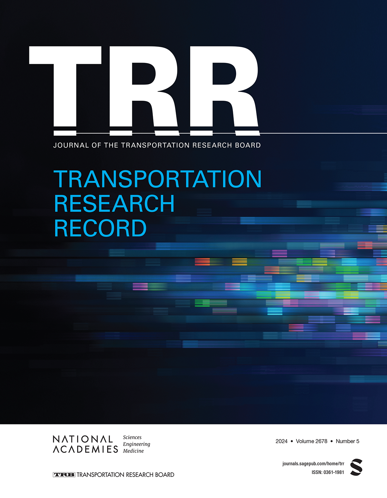

# Random Regret Minimization approach for Commuting mode choice in São Paulo, Brazil
R sripts for Caldeira, G. P. and Isler, C. A. Random Regret Minimization to Commuting Mode Choice in São Paulo, Brazil. Transportation Research Record. 1–14. 2024.

You can find the link for the paper here: (https://journals.sagepub.com/doi/abs/10.1177/03611981241242062)

In case you use the code or the paper in you research, please cite it!
